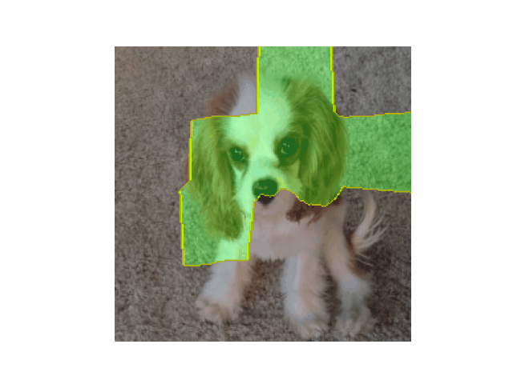
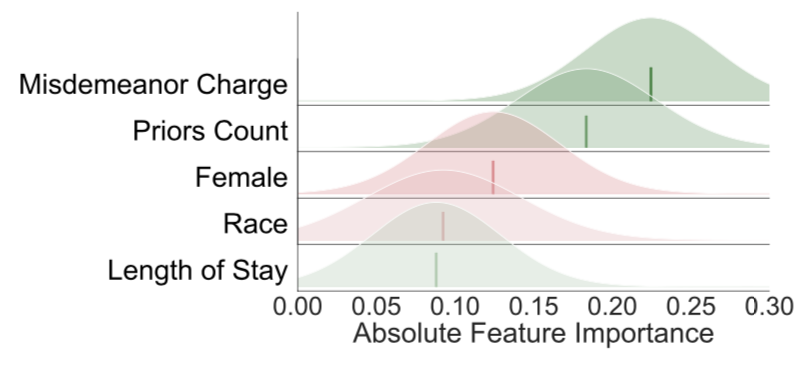

# Reliable Post hoc Explanations: Modeling Uncertainty in Explainability

Welcome to the code for our paper, Reliable Post hoc Explanations: Modeling Uncertainty in Explainability, published at NeurIPS 2021. We encourage you to read the [full paper](https://arxiv.org/abs/2008.05030).

Visualizing the posteriors of BayesLIME explanations on an image of a dog and COMPAS:

<p float="middle">


</p>

## Citation

If you found this work useful, please cite us:

```
@inproceedings{reliableposthoc:neurips21,
  author = {Dylan Slack and Sophie Hilgard and Sameer Singh and Himabindu Lakkaraju},
  title = { {Reliable Post hoc Explanations Modeling Uncertainty in Explainability} },
  booktitle = {Neural Information Processing Systems (NeurIPS)},
  year = {2021}
}
```

## Examples

An example usage of the explainer is provided in `./visualization/image_posterior_example.py`, where we visualize the posterior of a BayesLIME explanation on an image of the first author's dog.

## Experiments

### Data

#### Tabular Data

The German Credit + COMPAS datasets are included in the `./data` folder. Within experiments, the german credit data set is called as `--dataset german` and compas is called as `--dataset compas`.

#### MNIST

The MNIST data is set to download automatically on the first run.

In places where the MNIST data is accepted, by specifying the `--dataset` flag, it is possible to select the digit on which to run the experiment by specifying, for example, `--dataset mnist_1` for the 1 digit or `--dataset mnist_3` for the 3 digit, and so on.

#### ImageNet

To download the ImageNet data, use [this script](https://github.com/mf1024/ImageNet-Datasets-Downloader), selecting the appropriate class indices (e.g., n02108915 is the French Bulldog class used in the paper). For example, to download the French Bulldog data, run:

```python
python ./downloader.py 
    -data_root ./data/imagenet/frenchbulldog \
    -use_class_list True \
    -class_list n02108915 \
    -images_per_class 100 
```

Once the imagenet dataset is installed, it can be called with `--dataset imagenet_classname` where `classname` is the name of the folder where the data is stored (for instance `frenchbulldog` running the script above).

### Models

The tabular models are trained when they are called in experiments. The pre-trained MNIST model is provided in the `./data/mnist` subfolder. The VGG16 IMAGENET model will be downloaded when it is called.

### Experiments

Code to run experiments from the paper is included in the `./experiments` directory within the project.

### Hardware Requirements

For image experiments, GPU/TPU acceleration is recommended. I ran most of the experiments for this paper with a single NVIDIA 2080TI and a few with a NVIDIA Titan RTX.

For the tabular experiments, it's possible to run them on CPU. I tested this using a 1.4 GHz Intel Core i5 from a 2019 MacBook Pro, and it seemed to work fine. In places in the experiments where multithreading is used (`--n_threads`) in the experiments, be careful to use a value less than the avaliable cores on your CPU. I noticed that if I set `--n_threads` value too high on the MacBook, it caused it to freeze. 

### Questions

You can reach out to [dslack@uci.edu](mailto:dslack@uci.edu) with any questions.

